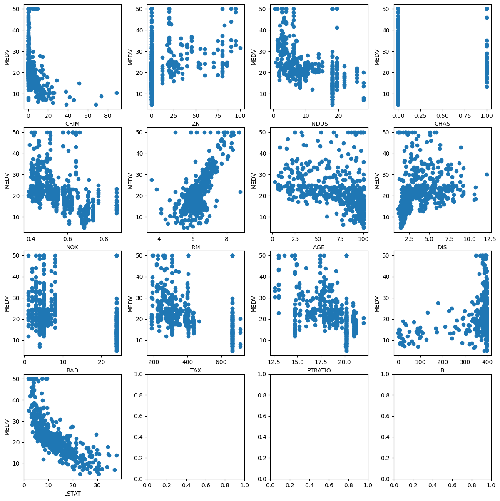

# Linear Regression 线性回归模型

> 该文章作为机器学习的第一篇文章，主要介绍线性回归模型的原理和实现方法。
>
> 更多相关工作请参考：[Github](https://github.com/swx3027925806/MachineLearning)

## 算法介绍

线性回归模型是一种常见的机器学习模型，用于预测一个连续的目标变量（也称为响应变量）与一个或多个自变量之间的线性关系。

### 算法原理解析

#### 传统版本
线性回归模型是一种常见的机器学习模型，用于预测一个连续的目标变量（也称为响应变量）与一个或多个自变量之间的线性关系。在该模型中，自变量和目标变量之间的关系可以表示为一条直线的函数。**该模型的目标是找到最佳的直线，使得预测结果与实际结果之间的误差最小。** 线性回归模型通常使用最小二乘法进行训练，即通过最小化预测值与真实值之间的平方误差来确定最佳拟合直线的参数。

线性回归模型的形式为$y = w·x + e$，其中e为误差，服从均值为0的正态分布。线性回归模型可以分为一元线性回归分析和多元线性回归分析。在一元线性回归分析中，只包括一个自变量和一个因变量，且二者的关系可用一条直线近似表示。在多元线性回归分析中，包括两个或两个以上的自变量，且因变量和自变量之间是线性关系。

线性回归模型有一些限制，例如它只能处理线性关系，对于非线性关系的数据拟合效果不佳。此外，**该模型对异常值敏感，如果数据中存在异常值，可能会导致模型的误差较大。**

线性回归模型具有简单易用、易于解释和理解等优点，因此在许多实际应用中都表现良好，如房价预测、销售预测等。然而，对于非线性关系的数据拟合问题，可能需要使用其他类型的回归模型，如多项式回归、逻辑回归、岭回归等。

#### 故事版本

想象一下，你有一群朋友，每个朋友都有一个身高和一个体重。你想找到一个公式，能够根据身高预测体重。这个公式可能看起来像这样：体重（W） = 身高（H） + 误差（E）。这里的“误差”就像生活中的小意外，它告诉我们身高并不总是完美预测体重的。

现在，你想使用所有朋友的数据来找到最佳的预测公式。线性回归模型就像一个魔法机器，能够“学习”最佳的预测公式。它通过比较每个朋友的身高和体重，找出最接近所有数据的直线。这条直线就是最佳的预测公式。

为了找到这条直线，线性回归模型使用了一种叫做“最小二乘法”的魔法工具。这个工具能够计算每个朋友与预测直线之间的距离，并找出使所有距离之和最小的直线。

一旦找到了最佳的预测公式，你就可以使用它来预测新朋友的体重了！比如，如果你遇到一个新朋友，只知道他的身高，你就可以用线性回归模型预测他的体重。

这就是线性回归模型的算法原理！它就像一个魔法预测器，能够根据自变量（如身高）预测因变量（如体重）。希望这个简单的比喻能帮助你理解线性回归模型的工作原理！

### 数学原理

首先，让我们了解一下最小二乘法。简单来说，最小二乘法是一种数学优化技术，它通过最小化误差的平方和来寻找最佳函数匹配。在回归分析中，最小二乘法用于找到最佳拟合直线的参数。

现在，让我们通过一个简单的例子来理解最小二乘法。假设我们有一组数据点，每个点都有一个x坐标和一个y坐标。我们的目标是找到一条直线，使得所有数据点到这条直线的垂直距离之和最小。

假设这条直线的方程是 y = w·x + e，其中w是斜率，e是截距。为了找到最佳的w和e，我们可以使用最小二乘法。

具体来说，对于每个数据点 (xi, yi)，我们计算它到直线的垂直距离的平方，即 $(yi - (wx + e))^2$。然后，我们将所有这些平方距离加起来，得到一个误差平方和。我们的目标是找到w和e，使得这个误差平方和最小。

数学上，这个问题可以表示为：

$$
S = Σ[(yi - (w·xi + e))^2]
$$

其中Σ表示求和符号。

为了找到最优的m和c，我们可以对误差平方和求关于m和c的偏导数，并令偏导数为零。这样我们就可以得到一个线性方程组，解这个方程组就可以得到w和e的最优解。最小二乘法公式如下：

$$
w = (\mathbf{X}^{\mathrm{T}}\mathbf{X})^{-1}\mathbf{X}^{\mathrm{T}}\mathbf{y}
$$

现在，让我们来谈谈为什么我们要用最小二乘法来求解线性回归模型。线性回归模型是一种预测模型，它通过找到最佳拟合数据的直线（或平面），来预测一个目标变量的值。这个模型基于的假设是目标变量和特征变量之间存在线性关系。

使用最小二乘法的优点是它可以提供一个精确的、无偏的估计，这意味着它能够找到最佳拟合数据的直线，使得预测值与实际值之间的误差最小。此外，最小二乘法还具有一些良好的数学性质，例如它有唯一解并且解是稳定的。

最重要的是，最小二乘法在很多情况下都非常有效且易于计算。通过最小二乘法，我们可以快速地找到线性回归模型的参数，从而进行准确的预测。

## 数据集介绍

这里我们介绍一个十分经典的数据集——**波士顿房价数据集** 。该数据集包含506个样本，13个特征，以及一个目标变量——房屋价格中位数。

波士顿房价数据集是一个非常经典的数据集，被广泛用于机器学习和数据分析领域。这个数据集包含了波士顿地区不同社区的房价信息:

| 参数 |属性|
|:--------:| :---------:|
|CRIM--城镇人均犯罪率  | 城镇人均犯罪率|
|ZN - 占地面积超过25,000平方英尺的住宅用地比例。  | 住宅用地所占比例|
|INDUS - 每个城镇非零售业务的比例。    | 城镇中非商业用地占比例|
|CHAS - Charles River虚拟变量（如果是河道，则为1;否则为0    | 查尔斯河虚拟变量，用于回归分析|
|NOX - 一氧化氮浓度（每千万份）  | 环保指标|
|RM - 每间住宅的平均房间数  | 每栋住宅房间数|
|AGE - 1940年以前建造的自住单位比例  | 1940年以前建造的自住单位比例|
|DIS -波士顿的五个就业中心加权距离   | 与波士顿的五个就业中心加权距离|
|RAD - 径向高速公路的可达性指数  | 距离高速公路的便利指数|
|TAX - 每10,000美元的全额物业税率  | 每一万美元的不动产税率|
|PTRATIO - 城镇的学生与教师比例  | 城镇中教师学生比例|
|B - 1000（Bk - 0.63）^ 2其中Bk是城镇黑人的比例   | 城镇中黑人比例|
|LSTAT - 人口状况下降％   | 房东属于低等收入阶层比例|
|MEDV - 自有住房的中位数报价, 单位1000美元  | 自住房屋房价中位数|

这个数据集的主要目的是通过机器学习算法，利用这14个特征预测房价中位数。在数据集中，每个样本包含一个社区的房价信息和相关的特征变量，例如社区的犯罪率、住宅用地比例、非商业用地比例、是否临河、房间数等。机器学习算法将根据这些特征变量预测房价中位数，从而帮助房地产经纪人、投资者或购房者更好地了解市场趋势和预测房价。

波士顿房价数据集是一个非常有价值的数据集，因为它包含了多个与房价相关的特征变量，并且数据来源于一个实际的房地产市场。这个数据集被广泛用于机器学习和数据分析的教学和实践，是入门机器学习和数据分析领域的经典案例之一。

接下来我们将对原始数据集进行处理，并对其进行特征工程，最终得到一个更加适合线性回归模型的数据集。数据集的地址在`dataset\housing.data`，大家可以直接使用。

## 代码实现


```python
# 准备好我们需要使用的第三方包
import os
import numpy as np
import pandas as pandas
import matplotlib.pyplot as plt

```

### 数据分析
为什么要去做数据分析？许多人并不是很关心数据的分析工作，这是存在极大问题的。

在机器学习中，数据分析是一个非常重要的步骤，主要原因如下：

首先，数据分析可以帮助我们更好地了解数据集的性质和结构，从而确定最佳的数据预处理和特征选择方法。通过数据分析，可以识别出异常值、缺失值等问题，并进行相应的处理，提高数据质量。

其次，数据分析可以帮助我们发现数据的内在规律和模式。例如，通过分析数据的相关性、聚类情况、分布情况等，可以发现数据中存在的有趣模式和关系，这些信息可以帮助我们更好地理解数据，并为后续的模型训练提供有价值的指导和建议。

### 如何做数据分析

针对不同数据集，数据分析的侧重点会有所不同，但一般而言，数据分析的基本步骤和考虑因素是相似的。以下是针对不同数据集进行分析时可能需要特别关注的几个方面：

1. **数据探索** ：对于任何数据集，首先需要进行探索性数据分析，以了解数据的分布、特征和规律。对于大规模的数据集，可能需要进行抽样调查或使用其他统计方法来初步了解数据。
2. **数据清洗** ：在处理任何数据集时，都需要关注数据的质量和清洁度。这包括处理缺失值、异常值、重复数据等问题，以及进行必要的格式转换和数据转换。
特征选择：对于不同的数据集，特征的选取和分析也是不同的。例如，对于文本数据，可能需要关注词频、主题模型等特征；对于图像数据，可能需要关注颜色、纹理等特征。
3. **可视化分析** ：对于复杂的数据集，可视化是一种有效的分析方法。通过绘制图表、制作地图或使用其他可视化工具，可以更好地理解和解释数据。
总之，针对不同数据集进行分析时，需要根据数据的特性和项目需求来选择合适的数据分析方法和侧重点。同时，数据分析师还需要不断学习和探索新的数据分析技术和方法，以更好地应对各种复杂的数据分析任务。

当然，数据分析远不止这些步骤，但这三个是重中之重，可以很好的帮助研究人员发现任务中所存在的问题。


```python
def load_data(file_path):
    # 读取数据文件
    names = ["CRIM", "ZN", "INDUS", "CHAS", "NOX", "RM", "AGE", "DIS", "RAD", "TAX", "PTRATIO", "B", "LSTAT", "MEDV"]
    data = pandas.read_csv(file_path, names=names, delim_whitespace=True)
    # 删除包含缺失值的数据行
    data = data.dropna()
    return data

def preprocess_data(data, func="del"):
    # 删除有缺失的数据
    if func == "del":
        data = data.dropna()
    # 通过均值的方式填充确实的数据
    elif func == "fill":
        data = data.fillna(data.mean())
    return data


data = load_data("dataset\\housing.data")
data = preprocess_data(data)                 # 该数据不存在缺失值

```


```python
# 展示每列数据和价格的关系，并以4*4的画布展示,并调整画布大小
def plot_price_relation(data):
    fig, axes = plt.subplots(nrows=4, ncols=4, figsize=(12, 12))
    # 控制画布中子图之间的间距
    plt.tight_layout()
    for i, col in enumerate(data.columns[:-1]):
        ax = axes[i // 4, i % 4]
        ax.scatter(data[col], data["MEDV"])
        # 设置titile 并控制字体大小
        # ax.set_title(f"{col} vs MEDV", fontsize=10)
        ax.set_xlabel(col, fontsize=10)
        ax.set_ylabel("MEDV", fontsize=10)
    plt.show()

plot_price_relation(data)
```


    

    


```python
# 将波士顿数据集按照8:2的比例划分成训练集和验证集
def split_data(data, test_ratio):
    np.random.seed(42)
    shuffled_indices = np.random.permutation(len(data))
    test_set_size = int(len(data) * test_ratio)
    test_indices = shuffled_indices[:test_set_size]
    train_indices = shuffled_indices[test_set_size:]
    return data.iloc[train_indices], data.iloc[test_indices]

# 划分训练集和验证集
train_set, test_set = split_data(data, 0.2)
```

### 构建线性回归模型

构建一个机器学习模型，通常我们需要包含以下几个部分：模型的训练、模型的评估、模型的推理，以及模型的代价函数等。在该部分，我会以线性回归模型为例，讲解如何构建一个完整的机器学习模型。同时，现有的sklearn库中已经提供了线性回归模型的实现，因此，我们平时仅需要调用sklearn库中的线性回归模型即可。

#### 基础实现

这里我们将构建`MyLinearRegression`类作为线性回归模型的基类。在这个类中，我们需要有以下几个函数：
1. `__init__`：初始化模型参数。
2. `fit`：使用训练数据来训练模型参数。
3. `predict`：使用训练好的模型参数来进行预测。
4. `loss`：计算模型的损失函数。

而需要注意的是，为了提升模型的性能，我们还需要对数据做一些处理，保证模型的稳定性。例如，我们可以使用标准化（standardization）或归一化（normalization）来对数据进行预处理。


```python
# 通过最小二乘法求解线性回归

class MyLinearRegression:
    def __init__(self):
        self.mean, self.std = None, None
        self.w, self.b = None, None
    
    def fit(self, X, y):
        X = self.data_preprocess(X)
        self.w = np.linalg.inv(X.T.dot(X)).dot(X.T).dot(y)
        self.b = np.mean(y - X.dot(self.w))

    def data_preprocess(self, X):
        if self.mean is None:
            self.mean = np.mean(X, axis=0)
            self.std = np.std(X, axis=0)
        return (X - self.mean) / self.std
    
    def loss(self, y, y_pred):
        return np.mean((y - y_pred) ** 2)
    
    def predict(self, X):
        X = (X - self.mean) / self.std
        return np.dot(X, self.w) + self.b
```


```python
# 训练波士顿数据，并验证
def main(train_set, test_set):
    X_train = train_set.drop("MEDV", axis=1)
    y_train = train_set["MEDV"]
    X_test = test_set.drop("MEDV", axis=1)
    y_test = test_set["MEDV"]
    
    model = MyLinearRegression()
    model.fit(X_train, y_train)
    w, b = model.w, model.b
    y_pred = model.predict(X_test)
    mse = model.loss(y_test, y_pred)

    print("w:%s b:%7.5f 均方误差：%7.5f" % (w, b, mse))
```


```python
main(train_set, test_set)
```

    w:[-1.00106928  0.71053112  0.26395035  0.71843347 -1.99922398  3.13938815
     -0.1673871  -3.07870731  2.26939584 -1.79124484 -2.03043684  1.12760396
     -3.60788753] b:22.79309 均方误差：24.39683
    

#### 基于sklearn模型的实现方式

`sklearn`作为机器学习中经典的库，提供了线性回归的实现。我们可以通过`sklearn.linear_model.LinearRegression`来使用`sklearn`的线性回归模型。以下是通过`sklearn`实现线性回归的代码示例：


```python
# 通过sklearn的方式来求解
from sklearn.linear_model import LinearRegression

def sklearn_main(train_set, test_set):
    X_train = train_set.drop("MEDV", axis=1)
    y_train = train_set["MEDV"]
    X_test = test_set.drop("MEDV", axis=1)
    y_test = test_set["MEDV"]
    model = LinearRegression()
    model.fit(X_train, y_train)
    y_pred = model.predict(X_test)
    mse = np.mean((y_test - y_pred) ** 2)
    print("w:%s b:%7.5f 均方误差：%7.5f" % (model.coef_, model.intercept_, mse))
```


```python
sklearn_main(train_set, test_set)
```

    w:[-1.13053410e-01  3.07557545e-02  3.83750160e-02  2.78643336e+00
     -1.70055351e+01  4.43604743e+00 -5.98876791e-03 -1.44796060e+00
      2.64769508e-01 -1.08061172e-02 -9.13265214e-01  1.23437822e-02
     -5.08514822e-01] b:30.14522 均方误差：24.39683
    

## 总结一下

在机器学习算法中，线性回归是一种常用的算法，它通过拟合一个线性模型来预测目标变量。在实现线性回归算法时，可以使用自己编写的代码或者使用现有的库函数来实现。自己编写代码可以更好地理解线性回归算法的原理和实现细节，而使用库函数可以简化代码编写的过程，提高开发效率。因此，选择合适的实现方式是实现线性回归算法的重要一步。

线性回归模型作为机器学习中经典的算法之一，广泛应用于各种数据分析和预测任务中。其基本的原理是通过拟合一个线性模型来预测目标变量。数学推导证明了，我们可以通过最小化损失函数来求解线性回归模型的参数，从而实现对目标变量的预测。其方法便是经典的最小二乘法。在实际应用中，线性回归算法可以通过各种方式进行改进和优化，例如正则化、特征选择、集成学习等。这些方法可以提高模型的预测精度和泛化能力，使线性回归算法在各种数据分析和预测任务中更有效地应用。


